## Ontology based semantic layer

1. Business Facing Ontology: A simple description of real world concepts of your business and how they relate, articulated in a way to make sense to human users.
2. Technical Ontology: The metadata of your data asset landscape, where your data lives, the schema and attributes, and their physical locations. 
3. Mapping between Business and Technical ontology: Customer entity which has a first name is mapped to Customer system of records Oracle database with column f_name.
4. Execution Traces/Runtime signals: Signals from agent executions, including decisions, paths, outcomes and errors. 

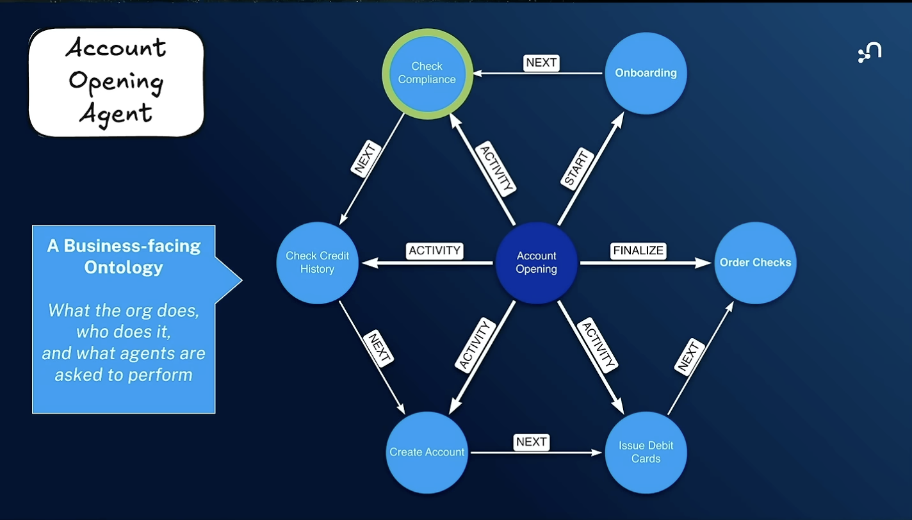

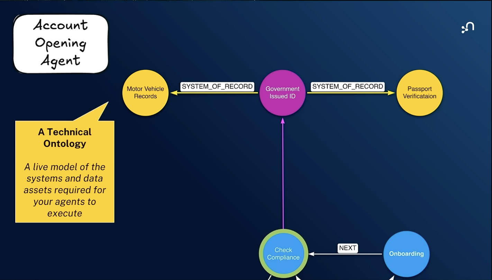

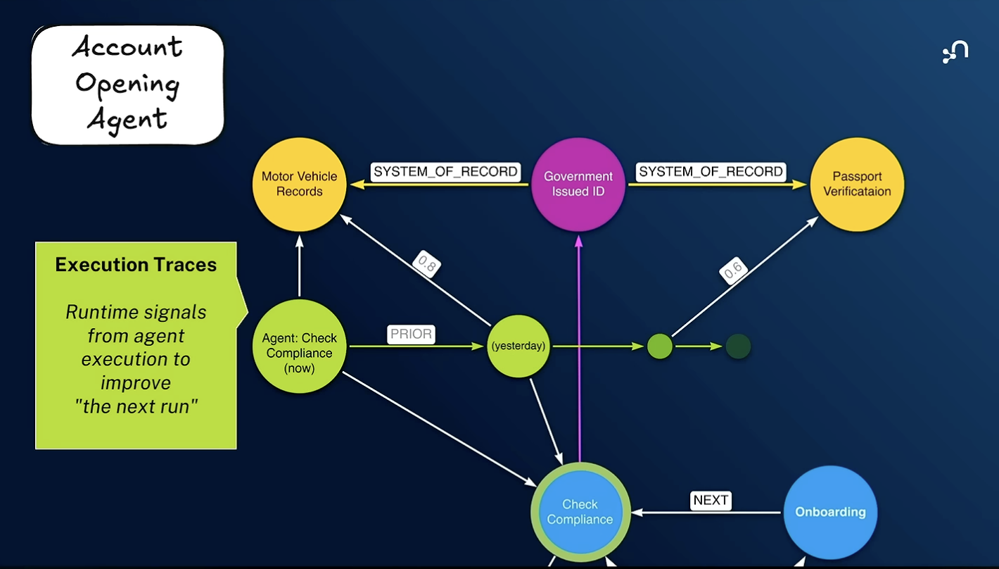

## RDF - Resource Definition Framework

## OWL - Web Ontology Language
Ref: https://www.youtube.com/watch?v=Sir59K8ZDPU

1. Define a domain
2. Extract entities and relationships from a domain

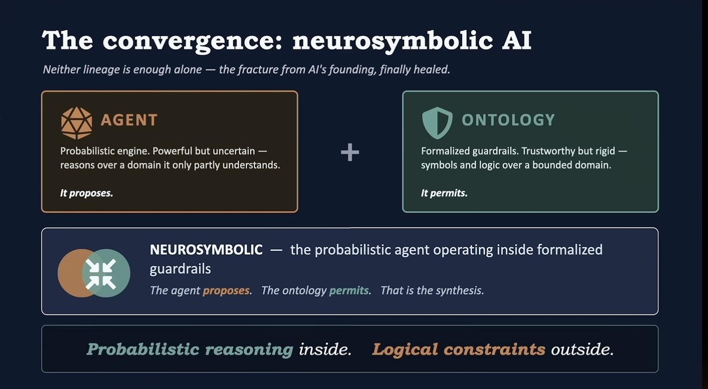

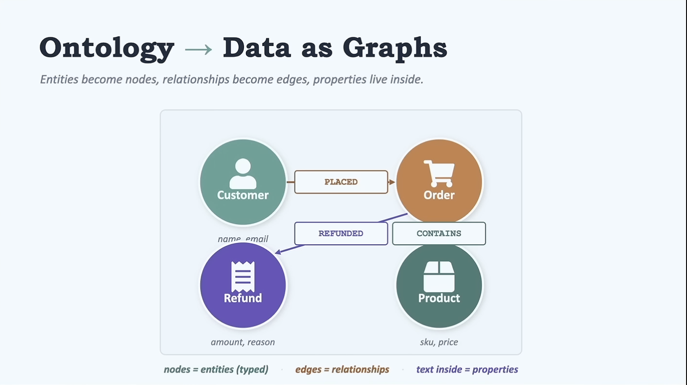

## How to build ontologies

Top down and bottom up

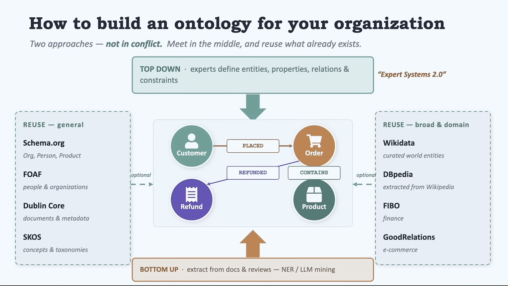

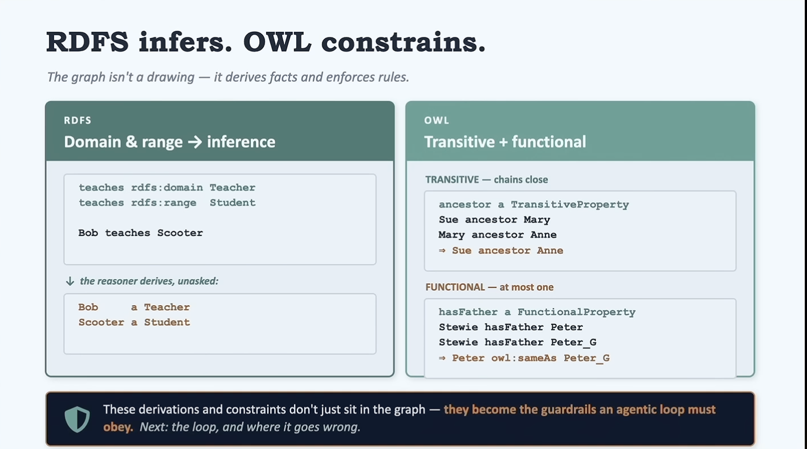

## Agentic loop engineering with Ontology

Ontology at the Ledger: Validate the result against domain rules - cardinality, roles, world-state coherence. Caught before it propagates

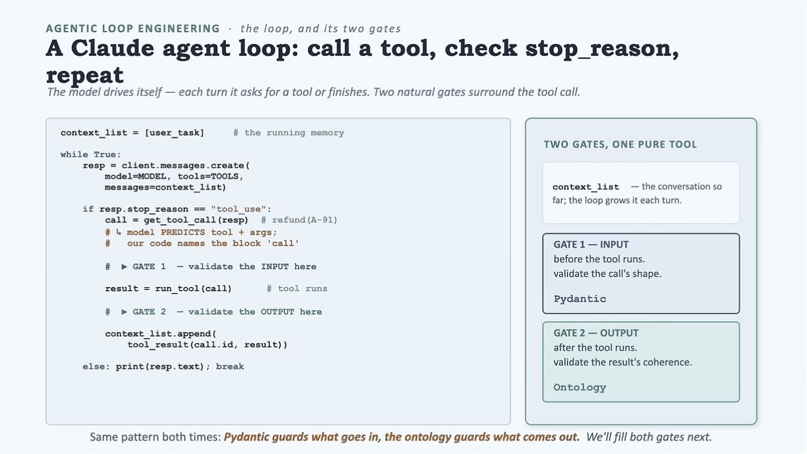

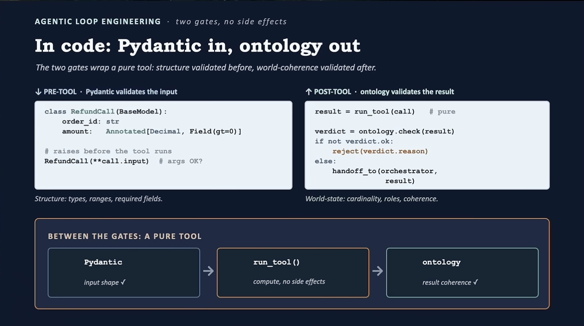

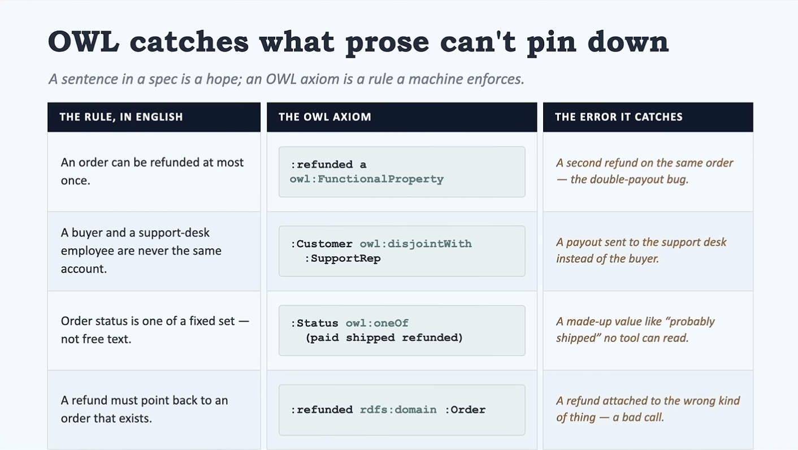

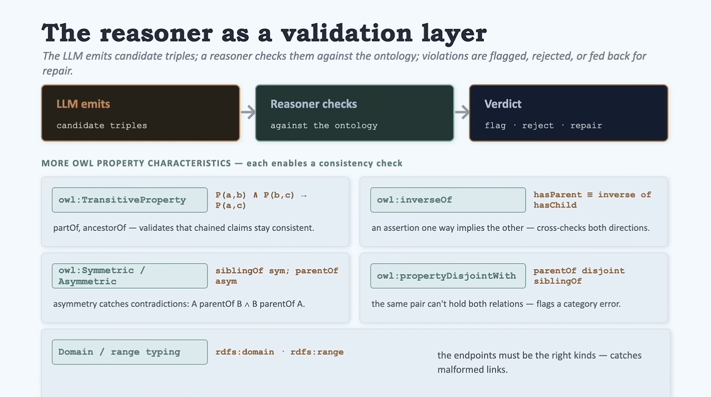

## Databricks Genie Ontology
Domain ontology is essentially a set of pages(Discover) linked to assets - structured(tables) and unstructured(volumes) data in databricks.
Questions:
1. How is the data ingested referring to the above pages - or the data is ingested and ontology works on top of it and agents refer to ontology instead of data directly?
2. Where are the vector index and Graph DB for Genie Ontology - can we assume they are transparent to us?
3. Agent is referring to the domain/ontology - so agent doesnt need to access Vector Index or GraphDB directly hence?
4. How can Foundry agents use the Databricks Genie Ontology and Data?
