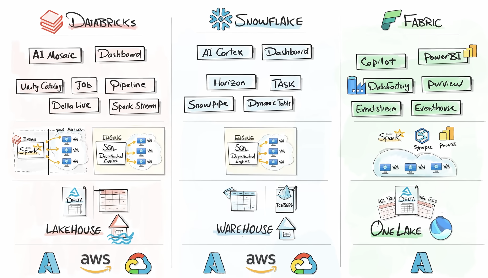

## Ontologies
1. Creation: How to build ontologies
    - Top down vs Bottom up? Should we extract it from data or business define it?
2. Industry Standards: Are we following any Industry standards for Ontology like FIBO? If yes, is it adopting FIBO as-is, or a customization inspired from FIBO?
3. Usage of Ontology: Should it only be used during construction of Knowledge Graph, or also during Graph query/retrival patterns - may not be needed as Knowledge Graph adheres to Ontology.
4. Types of Ontology: How many ontologies to maintain? Business and/or Technical or both?
5. Constraints: Use RDFS and/or OWL or both?
6. Data binding: Does Ontology need to map where the real world data lives like in Lakehouse or SQL database?
7. Versioning: How will we maintain versioned ontology?
8. How many ontologies: How many ontologies we maintain? common for entire NBS, one per domain, or heirarchical?

## Knowledge Graph
1. Graph Shapes/Model: What is the Graph Shape/Model to be achieved? Lexical Graph with Extracted Entities and Community Summaries?
2. Versioning : How will we maintain versioned Knowledge Graph for Retrieval Purposes?
3. Review: Does knowledge Graph need a review, OR a review of Ontology(Schema and constraints) is enough? as there will be many Entities and Relationships, and it is impossible to manually review the every change onto a Knowledge Graph.
4. Tests/Evals: How can we be sure that Knowledge Graph being changed/ adhers to the Ontology, and extracted relationships/entities/properties and relationship between lexical and domain graph is correct? 

## Technology
1. Data Platform: Databricks on Azure -VS- MS Azure Fabric ?
2. Ontology: Databricks Genie Ontology (transparent/background Knowledge Graph) -VS- Fabric IQ Ontology (transparent/background Knowledge Graph) -VS- Home-Grown Ontology and Knowledge Graph Layer?
3. Vector DB : Azure AI Search -VS- Databricks Search -VS- Neo4J itself?
4. Graph DB (only needed if Home-Grown Ontology): Neo4j Aura (SaaS) -VS- Neo4j Application through MS Azure Marketplace -VS- Azure Cosmos Gremlin?
5. Need for Vector and Graph DB: clear requirements of why we need to maintain these DB's? Can the conceptual method of Geneie Ontology not suffice?
6. Extracting Unstructured Data: Docling (opensource) -VS- Azure Document Intelligence?
7. Extracting Entities and Relationships based on schema: Langchain (LLMGraphTransformer), Neo4j(neo4j-graphrag-python, SimpleKGPipeline), LlamaIndex (PropertyGraphIndex), spaCy(Named Entity Recognition), Azure Language Service
8. Framework (only needed if Home-Grown Ontology): Which framework(neo4j, langchain, llamaindex) can be used for creation and retrival patterns for Knowledge Layer?
9. Agents: AgentBricks -VS- Foundry ?
10. Visualising RDFS/OWL constraints for approval: Protege - java based, -VS- Arrows.app / WebVOWL.
11. Ontology file formats: .owl, .rdf, .ttl
12. API Management: should the knowledge layer not sit behind APIM as it potentially can be reused by multiple agents of the same/diverse domains?

## Data Governance and Security
1. Permissions/Security/Governance: Individual data sources (confluence, Jira) permissions vs How will low level data permissions be mapped and ACLS be maintained in the Data LakeHouse?
2. Freshness of Data: How live the data will be in in databricks, what schedule?
3. Sensitive Data: How will PII and other data controls be managed of data stored in databricks? Also classification of sensitivity of data.
4. Source documents/citations: should they be original pages from confluence/jira links or raw documents stored in databricks bronze layer after ingestion?